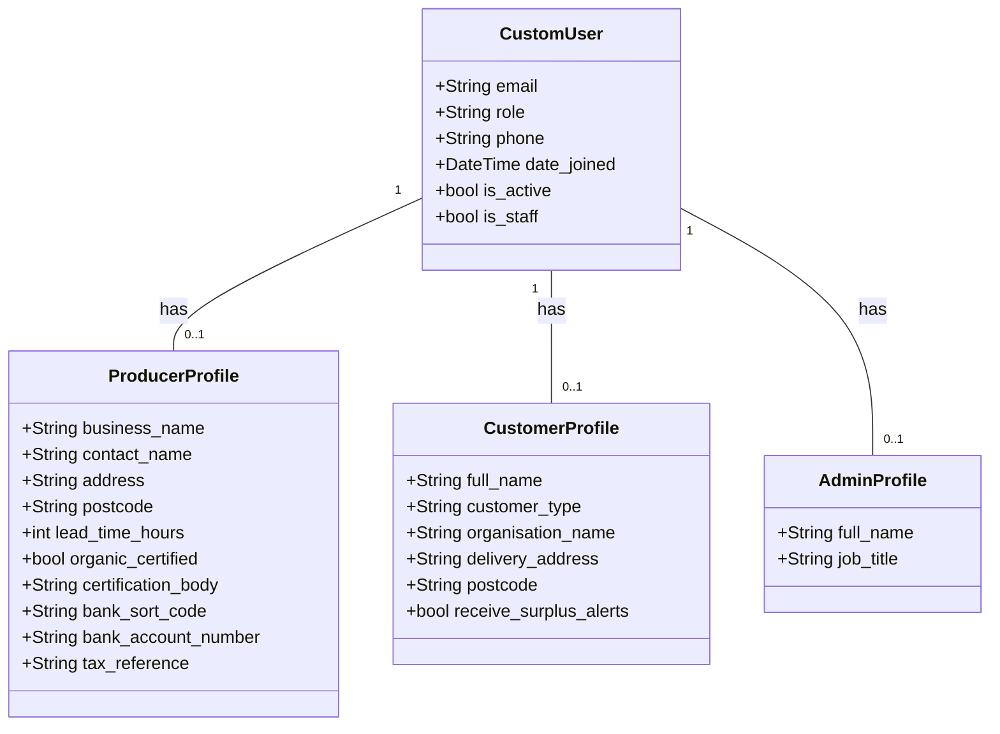

# Accounts Model Documentation

## Overview

The `accounts` model defines the authentication and profile structure for the platform. Instead of Django's default username-based login, it uses a custom user model with email as the identifier. Each user is assigned a role which determines what they can access and which profile model holds their information.

## Key Relationships

- **CustomUser:** The base user model that handles all authentication. Each profile model (ProducerProfile, CustomerProfile, and AdminProfile) is linked to a single CustomUser instance via a One-to-One relationship.

- **ProducerProfile:** One-to-One relationship with CustomUser. Only exists for users with role PRODUCER.

- **CustomerProfile:** One-to-One relationship with CustomUser. Covers individual customers, community groups, and restaurants.

- **AdminProfile:** One-to-One relationship with CustomUser. Only exists for users with role ADMIN

## Entity Relationship Diagram (ERD)

[Image of accounts entity relationship diagram]



## Access Control

Views are protected using role-based decorators:

```python
@producer_required      # PRODUCER only
@customer_required      # CUSTOMER, COMMUNITY_GROUP, RESTAURANT
@admin_required         # ADMIN only
@community_group_required   # COMMUNITY_GROUP only
@restaurant_required        # RESTAURANT only
@producer_or_admin_required # PRODUCER or ADMIN
```