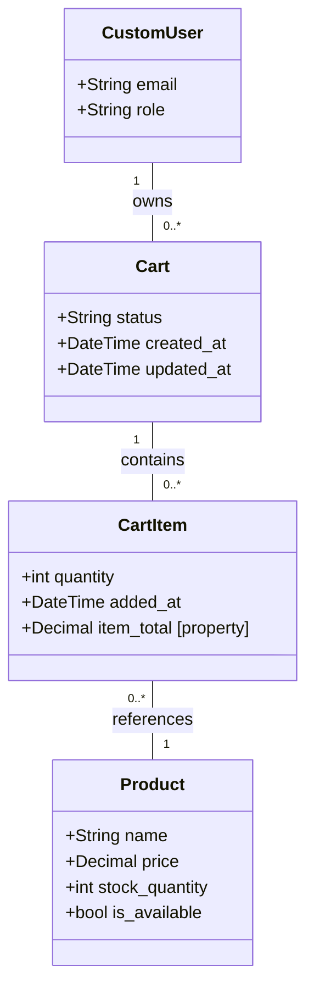

# Cart Model Documentation

## Overview

The `Cart` and `CartItem` models provide server-side shopping cart persistence for logged-in customers. The cart is tied to the authenticated user (not the session), so it persists across browsers and devices.

## Key Relationships

- **User:** Foreign Key to `CustomUser`. Each user has at most **one active cart**, enforced by a database-level `UniqueConstraint`.
- **Product:** `CartItem` links to `Product` via Foreign Key. One row per product per cart (enforced by `unique_together`).

## Entity Relationship Diagram

## Fields

### Cart

| Field | Type | Description |
|---|---|---|
| `user` | ForeignKey → CustomUser | The customer who owns this cart |
| `status` | CharField (choices) | `active`, `ordered`, or `abandoned` |
| `created_at` | DateTimeField | Auto-set on creation |
| `updated_at` | DateTimeField | Auto-set on every save |

### CartItem

| Field | Type | Description |
|---|---|---|
| `cart` | ForeignKey → Cart | The parent cart |
| `product` | ForeignKey → Product | The product being purchased |
| `quantity` | PositiveIntegerField | Number of units (min 1) |
| `added_at` | DateTimeField | Auto-set on creation |
| `item_total` | Property (computed) | `product.price × quantity` — always uses live price |

## Constraints

| Constraint | Type | Purpose |
|---|---|---|
| `one_active_cart_per_user` | UniqueConstraint (conditional) | Only one cart with `status='active'` per user. Multiple `ordered`/`abandoned` carts are allowed. |
| `unique_together: (cart, product)` | Unique Together | Prevents duplicate rows. Adding an existing product increments quantity instead. |

## Design Decisions

1. **No price snapshot**: `CartItem` does not store a copy of the price. The `item_total` property always reads from `Product.price`. This means the cart is never stale with respect to pricing, but also means prices can change between add-to-cart and checkout.

2. **Server-side, not session-based**: Carts are stored in the database rather than the session. This allows persistence across devices, admin visibility, and atomic stock validation at the DB level.

3. **Soft status transitions**: When checkout is implemented, the active cart's status changes to `ordered` and a new active cart is created on the next add-to-cart action. The old cart remains for order history/audit.
