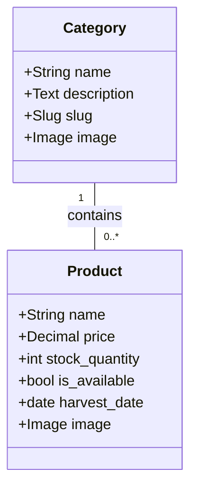

# Category Model Documentation

## Overview

The `Category` model represents a grouping of products in the marketplace (e.g. "Vegetables", "Fruits"). It is a central entity that organises products, enabling **filtering and display** by category. Each category can contain **multiple products**, forming a **one-to-many** relationship with the `Product` model.

## Key Fields

- **name:** The name of the category (must be unique).
- **description:** Optional text description of the category.
- **slug:** URL-friendly identifier automatically generated from the name, used for filtering.
- **image:** An image representing the category, used in UI elements such as carousels.

## Key Relationships

- **Products:** One-to-Many, a category can have multiple products, but each product belongs to exactly one category.

## Entity Relationship Diagram (ERD)

[Image of category-product entity relationship diagram]

