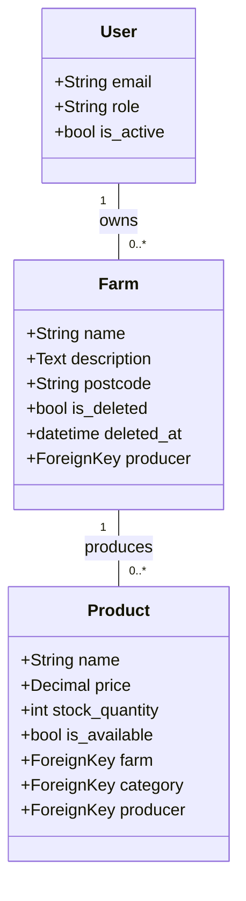

# Farm Model Documentation

## Overview

The `Farm` model represents the geographical origin of products in the marketplace. It is a central entity that supports traceability, farm-origin display and **environmental reporting** through postcode-based distance measurements. Each farm is linked to a `Producer` and each `Producer` can have multiple `farms`, forming a One-to-Many Relationship. Each `Farm` can supply multiple `Products`, forming a One-to-Many Relationship.

## Key Fields

- **producer:** The User/Producer who owns and operates the farm.
- **name:** The official name of the farm.
- **description:** Optional text providing details about the farm’s history, stories, or agricultural practices.
- **postcode:** The location identifier used to calculate "food miles" and sustainability metrics.
- **is_deleted / deleted_at:** Fields inherited from the SoftDeleteModel to maintain audit trails and logical data recovery.

## Key Relationships

- `Producer`: **Many-to-One**; a single producer can manage multiple farms, but each farm is owned by exactly one producer.
- `Products`: **One-to-Many**; a farm can produce a wide variety of products, but each product must be linked to a specific farm to ensure accurate origin tracking.

## Entity Relationship Diagram (ERD)

[Image of category-product entity relationship diagram]

