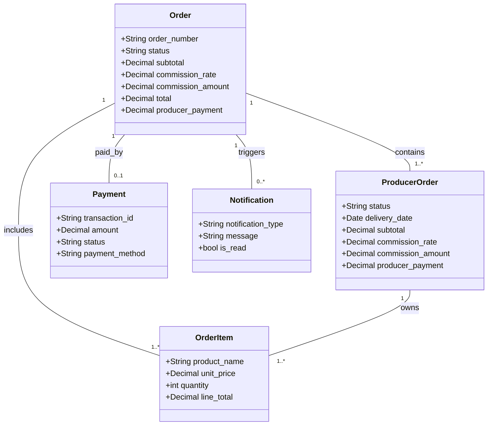

# Orders Model Documentation

## Overview

The orders domain now uses a **parent + sub-order** structure.

- `Order` is the customer-facing order (single order number, single payment)
- `ProducerOrder` is the producer-facing sub-order (delivery date, fulfilment state, producer payout)
- `OrderItem` links each purchased line to both levels

This design keeps the customer journey simple while preserving producer separation.

---

## Entity relationships

---

## Model-by-model notes

### `Order`

Customer-level order record.

**Key fields**

- `order_number`: immutable human-friendly ID (`ORD-XXXXXXXX`)
- `customer`: who placed the order
- `status`: overall lifecycle status
- `delivery_address`, `delivery_postcode`: shared delivery destination
- financial snapshot fields (`subtotal`, `commission_rate`, `commission_amount`, `total`, `producer_payment`)

**Important behaviour**

- `save()` generates `order_number` if missing
- `is_multi_vendor` returns true when there is more than one child `ProducerOrder`
- `calculate_financials()` aggregates totals from child `ProducerOrder` rows

> Note: `calculate_financials()` updates fields in memory; caller must still call `save()`.

---

### `ProducerOrder`

Producer-specific sub-order record.

**Why this exists**

A single customer order can involve multiple producers. Producer-specific delivery dates, statuses and payouts therefore live here.

**Key fields**

- `order`: parent `Order`
- `producer`: producer user account for this slice
- `delivery_date`: requested date for this producer's items
- producer-level financial snapshot fields

**Important behaviour**

- `calculate_financials()` sums only this producer's item lines
- `ordering = ["delivery_date"]` to support fulfilment planning views

> Note: same as parent model, this method does not save automatically.

---

### `OrderItem`

Immutable purchase snapshot.

**Key fields**

- `order`: parent order link
- `producer_order`: producer slice link
- `product`: nullable FK to current catalogue item (can be removed later)
- `product_name`, `unit_price`, `quantity`, `line_total`: historical snapshot data

**Important behaviour**

- `save()` sets `line_total = unit_price * quantity`

---

### `Payment`

One payment per parent order (`OneToOneField`).

For now, payment uses a test-mode stub:

- transaction ID auto-generated as `TXN-...`
- status defaults to `PENDING` and is set to `SUCCESS` in checkout flow
- amount equals parent order `total`

---

### `Notification`

Simple in-app notification model used for order events.

Typical usage in checkout:

- one `NEW_ORDER` notification per producer
- one `ORDER_CONFIRMED` notification for customer

---

## Design decisions and rationale

### Parent/sub-order split

This avoids brittle hacks where one order tries to pretend it belongs to one producer while containing many.

### Financial snapshots on both levels

We keep totals at both `Order` and `ProducerOrder` level so list/detail/API screens don't have to recalculate values repeatedly.

### Snapshotting line details

`OrderItem` keeps product name and price at purchase time, so old order history remains correct even if catalogue data changes later.

### Soft-delete support

`Order` and `ProducerOrder` inherit from `SoftDeleteModel`, which supports audit history without hard deletes.

---

## Migration notes

- `0003_multi_producer_checkout` introduced `ProducerOrder` and transitional compatibility
- `0004_remove_legacy_order_fields` removed the old single-producer fields from `Order` and made `OrderItem.producer_order` mandatory
