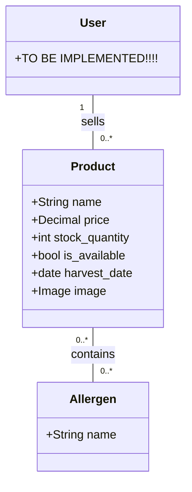

# Product Model Documentation

## Overview

The `Product` model represents a single food item listed by a Producer. It is the central entity of the marketplace, linking **Producers** (sellers) to **Orders** (transactions).

## Key Relationships

- **Producer:** Foreign Key to `User`. A product _must_ belong to one producer.
- **Allergens:** Many-to-Many relationship. A product can have multiple allergens (e.g., "Gluten", "Dairy"), and one allergen can apply to many products.

## Entity Relationship Diagram (ERD)

[Image of product entity relationship diagram]

